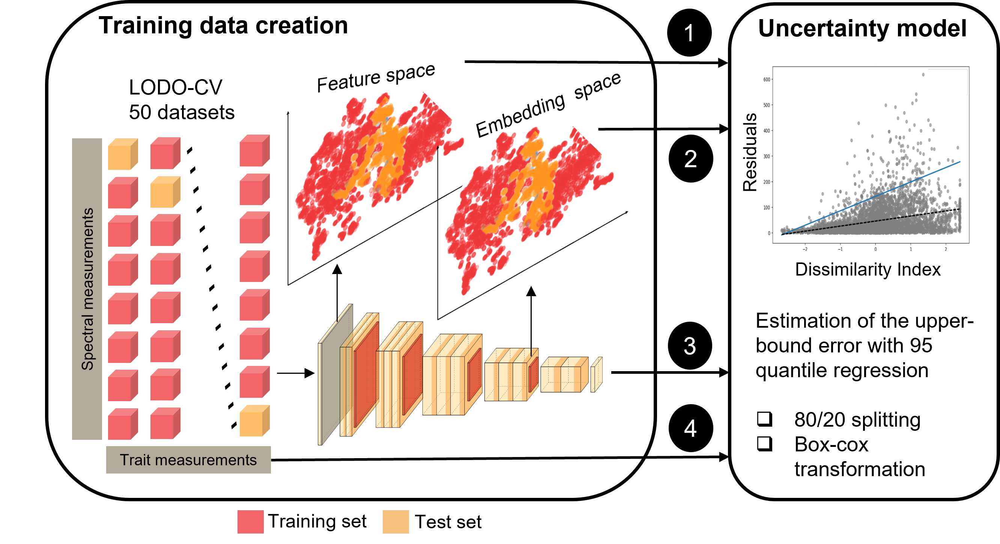

# 🌍 Uncertainty Assessment in Deep Learning-based Plant Trait Retrievals from Hyperspectral Data



## 📌 Description
With the advent of **Hyperspectral satellites** and **Deep Learning**, we have the chance to monitor **biodiversity on a global scale** as a contribution to **global digital data streams**. 

However, there is still a need for **methods that fully report the uncertainty** of deep learning-derived products. In this regard, this study introduces **Dis_UN**, a **novel distance-based method** for estimating **predictive uncertainty** in deep learning models for **plant trait retrievals**.

Unlike traditional uncertainty estimation approaches, **Dis_UN** quantifies **worst-case errors** by:
- Using **residuals** as a proxy for uncertainty.
- Measuring **dissimilarity in data manifolds**.

### 🔹 Key Findings:
- **Dis_UN effectively detects Out-Of-Domain (OOD) spectral variations**, such as **urban surfaces, clouds, and open water**.
- Provides **more reliable uncertainty estimates** compared to conventional methods, which often underestimate uncertainty.
- With the increasing availability of **hyperspectral data**, robust uncertainty quantification is **crucial for Earth Observation applications**.
- This method contributes to **uncertainty quantification in machine learning-derived maps**, offering a **practical tool for uncertainty assessment** valuable for **ecological and environmental analyses**.

---

## ⚙️ Setup & Installation

### **🔹 Requirements**
- **Python** `3.9.5`
- **TensorFlow** `2.7.0`
- Additional dependencies are listed in `requirements.txt`.

### **🔹 Installation Steps**
1. **Clone the repository**
2. **conda create -n <environment-name> python==3.9**
3. **conda activate <environment-name>**
4. **Install tensorflow (The trained model was tested for =2.7.0). May vary with your system.**
5. **cd into the cloned repo**
6. **pip install -r requirements.txt**


## 🚀 Usage

### 1️⃣ Distance Calculation
To generate the distances of a **new scene** to the training data, run:
```
python distInference.py \
  --r ./Data/TrainingSpectra_1522.csv \
  --modelpath ./DL_Model/ \
  --inferpath ./Data/CaseStudies/EnMAP/clip2_south.tif \
  --metapath ./Data/CaseStudies/EnMAP/EnmapBands.csv \
  --ne 50 \
  --lay -4 \
  --norVec True \
  --emb True \
  --sp True \
  --nor True \
  --gpu 0 \
  --sceneText clip2_southSpLastlayQuNor_Test
```


### 2️⃣ Apply the Model for Uncertainty Estimation
To infer uncertainty maps, run:

```
python distance_UN.py \
  --modelpath ./Un_models_95QuReg/ \
  --path_dist_ts ./distances/DistQuInferenceEnMAP_50neighFaiss_SpLastlayQuNor.csv \
  --sceneText clip2_southSpLastlayQuNor_Un 

```


